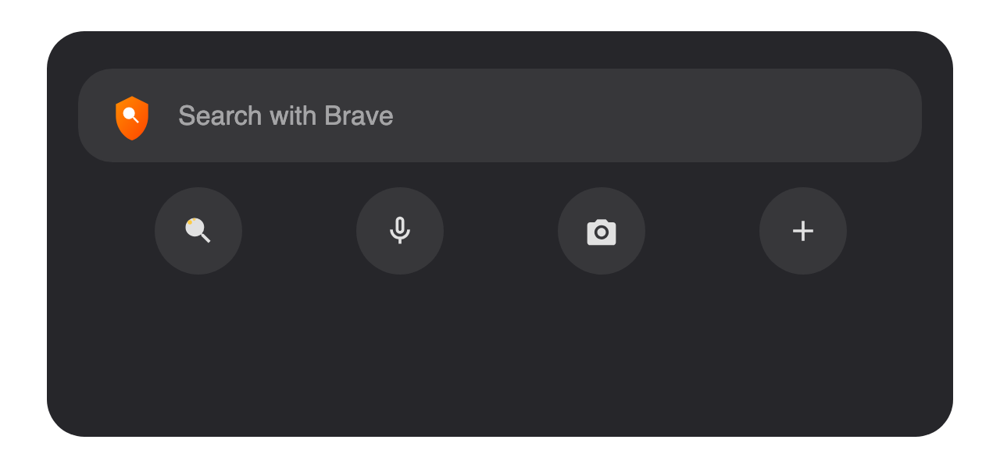
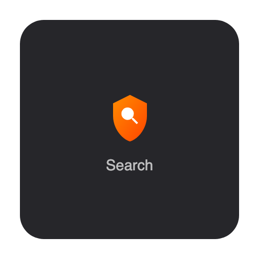

# PrivateSearch for iOS

A native iOS home screen widget and search app powered by [Brave Search](https://search.brave.com) — private, independent search right from your home screen.

<p align="center">
  
  
</p>

## Features

- **Home Screen Widget** — Search bar widget with quick action buttons, inspired by Google's iOS widget
- **Private Search** — Powered by Brave Search, which doesn't track you or your searches
- **Voice Search** — Tap the mic to speak your search query (uses Apple's Speech framework)
- **Image Search** — Switch to Images mode to search visually via Brave Image Search
- **Multiple Widget Sizes**
  - **Medium**: Search bar + 4 action buttons (AI Search, Voice, Image Search, New Tab)
  - **Small**: Shield icon with quick search tap
  - **Lock Screen**: Circular accessory widget for instant search access
- **Search Suggestions** — Real-time autocomplete as you type
- **Web Results** — Full search results with titles, URLs, and descriptions
- **Deep Linking** — Each widget button opens the app to a specific search mode

## Requirements

- iOS 17.0+
- Xcode 15.0+
- [Brave Search API key](https://brave.com/search/api/) (free $5 monthly credits)

## Getting Started

### 1. Clone the repository

```bash
git clone https://github.com/jlhernando/brave-widget-iOS.git
cd brave-widget-iOS
```

### 2. Open in Xcode

```bash
open BraveSearch.xcodeproj
```

### 3. Configure signing

- Select the **BraveSearch** target → **Signing & Capabilities** → set your **Development Team**
- Repeat for the **BraveSearchWidgetExtension** target

### 4. Build & Run

- Select an iPhone simulator or connected device
- Press **Cmd + R** to build and run

### 5. Get your Brave Search API key

1. Go to [brave.com/search/api](https://brave.com/search/api/)
2. Click "Get Started" and create an account
3. Subscribe (you get $5 in free monthly credits — ~1,000 searches/month)
4. Copy your API key from the dashboard
5. Open the app → tap the gear icon (Settings) → paste your key → Save

### 6. Add the widget to your home screen

1. Long-press on your home screen
2. Tap the **+** button (top left)
3. Search for "PrivateSearch"
4. Choose your preferred widget size (Medium recommended)
5. Tap **Add Widget**

## Project Structure

```
brave-widget-iOS/
├── BraveSearch.xcodeproj       # Xcode project
├── BraveSearch/                # Main app target
│   ├── BraveSearchApp.swift    # App entry point + deep link handling
│   ├── SearchView.swift        # Search UI, voice search, image search
│   ├── SettingsView.swift      # API key config + setup guide
│   ├── Info.plist              # URL scheme + permissions
│   └── Assets.xcassets/        # App icon + assets
├── BraveSearchWidget/          # Widget Extension target
│   ├── BraveSearchWidget.swift # Widget views + timeline provider
│   ├── Info.plist              # Widget extension config
│   └── Assets.xcassets/        # Widget assets
└── Shared/                     # Shared between app & widget
    ├── BraveSearchAPI.swift    # Brave Search API client
    └── URLScheme.swift         # Deep link URL scheme definitions
```

## How It Works

The widget uses Apple's **WidgetKit** framework. iOS widgets are static views — they can't host interactive text fields. Instead, the widget displays a styled search bar and action buttons that deep-link into the main app via the `bravesearch://` URL scheme.

| Widget Button | URL | App Action |
|---|---|---|
| Search bar | `bravesearch://search` | Opens app with search focused |
| AI button | `bravesearch://ai` | Opens search focused |
| Voice button | `bravesearch://voice` | Starts voice recognition |
| Image button | `bravesearch://image` | Switches to Image search mode |
| + button | `bravesearch://new` | Opens blank search |

## API Endpoints Used

| Endpoint | Purpose |
|---|---|
| `/res/v1/web/search` | Web search results |
| `/res/v1/suggest/search` | Search autocomplete suggestions |
| Brave Image Search (web) | Image search results |

## Contributing

Contributions are welcome! Please open an issue or submit a pull request.

1. Fork the repository
2. Create your feature branch (`git checkout -b feature/amazing-feature`)
3. Commit your changes (`git commit -m 'Add amazing feature'`)
4. Push to the branch (`git push origin feature/amazing-feature`)
5. Open a Pull Request

## License

This project is licensed under the MIT License — see the [LICENSE](LICENSE) file for details.

## Acknowledgments

- [Brave Search](https://search.brave.com) for providing the search API
- Inspired by the Google Search widget for iOS

---

**Disclaimer:** This project is not affiliated with or endorsed by Brave Software, Inc. Brave and the Brave logo are trademarks of Brave Software, Inc.
